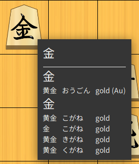

# Kanjinator

Kanjinator lets you select a part of your screen, performs
[OCR](https://en.wikipedia.org/wiki/Optical_character_recognition) on it and then displays a translation for the recognized words.

Currently only Japanese (using jisho.org) is supported, but the code is written in a way that would
allow adding other languages easily.

## Why?

Sometimes you have Kanji on your screen that you cannot simply copy, e.g as part of an image or a game. In this case it's really hard to look up the meaning of that kanji because you'd either need to know how it's pronounced or alternatively search the symbol by its radicals, which is pretty annoying.

### Example


## Installation

### Windows

Just use the the msi installer in the releases section and click next/yes until it works.

### Linux

This tool currently does not support wayland!
Unfortunately the Robot class from awt simply produces a completely white screenshot on wayland.
You'll need to have tesseract with the devel packages and openjdk installed on your system. Then just just use `java -jar` to run the jar file.

#### Example: Fedora

``` shell
sudo dnf install java-17-openjdk tesseract-devel
java -jar kanjinator-linux.jar
```

Older/Newer jdks might work, but i didn't test them.

## Building

You'll need to have [Leiningen](https://leiningen.org/) installed.

``` shell
git clone https://github.com/Funkschy/kanjinator
cd kanjinator
lein run
```

If you don't want to build it yourself, just grab a prebuilt jar from the releases site.

## Usage

After starting the program, you can simply select part of your screen by dragging the mouse over it.


## Extend

In contrast to its name, Kanjinator isn't actually built only for japanese. The application itself is in fact language agnostic. If you want to add another language, you just have to implement the Language protocol with regards to the dictionaries/spec.clj. Then you can just change the current-language inside of the config map in config.clj to use your language.
